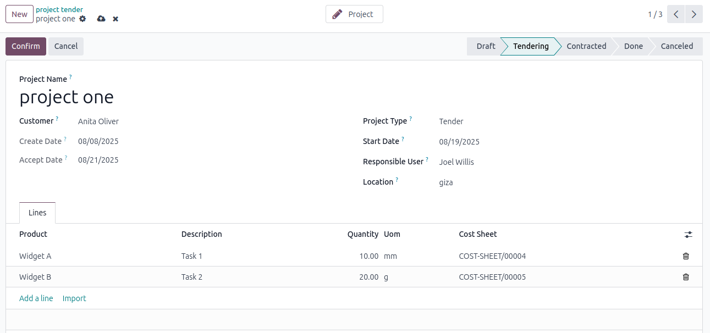
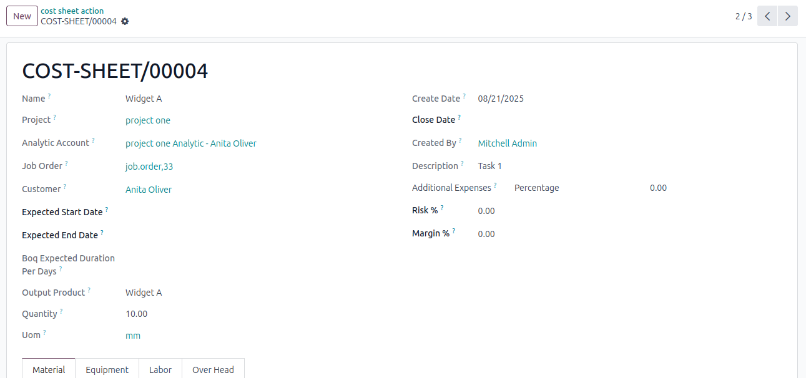
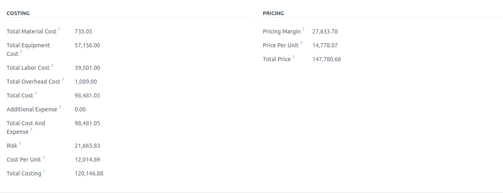

# Tender

## Screenshots

## Overview

The Tender module is an Odoo addon designed for construction project management. It provides tools to streamline tender management, create detailed cost sheets, and manage related processes efficiently. This module is ideal for construction companies looking to automate and organize their tendering and cost estimation workflows within the Odoo ERP system.

#### Features

Tender Management: Create, track, and manage tenders for construction projects, including bid submissions and evaluations.

Cost Sheet Creation: Generate detailed cost sheets with itemized expenses, labor, and materials for accurate project budgeting.

Project Integration: Seamlessly integrates with Odoo’s Project Management module to align tenders with project timelines and tasks.

Customizable Workflows: Configure tender stages and approval processes to match your business needs.

Reporting: Generate reports for tender status, cost breakdowns, and project profitability.

## Installation

##### You have to set the odoo18 environment firs 

To install the Tender module, follow these steps:

You have to set the odoo18 environment firs 

Download the module from the GitHub repository.

Place the module folder in your Odoo addons directory (e.g., /path/to/odoo/addons).

Update the Odoo apps list:

In Odoo, navigate to Apps > Update Apps List.

Search for the Tender in the Apps menu and click Install.

